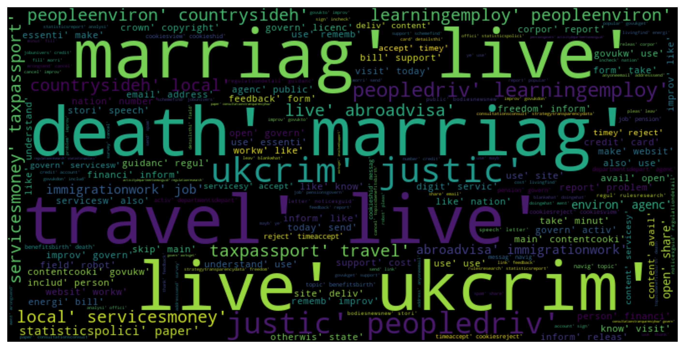
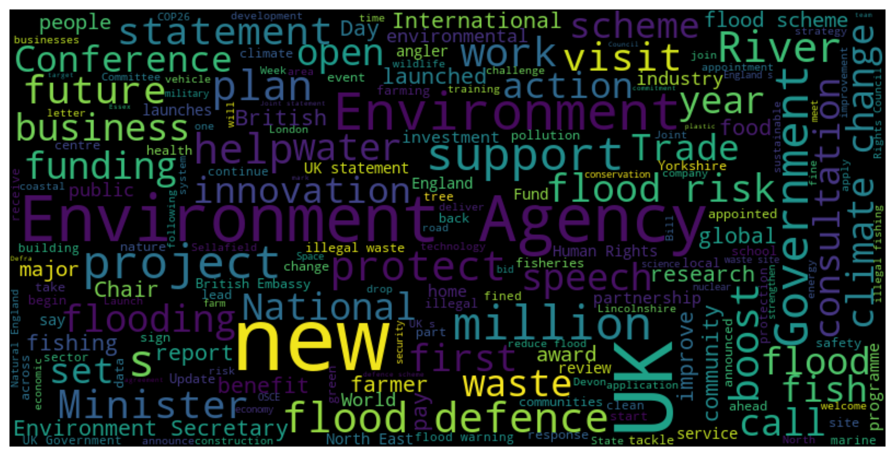
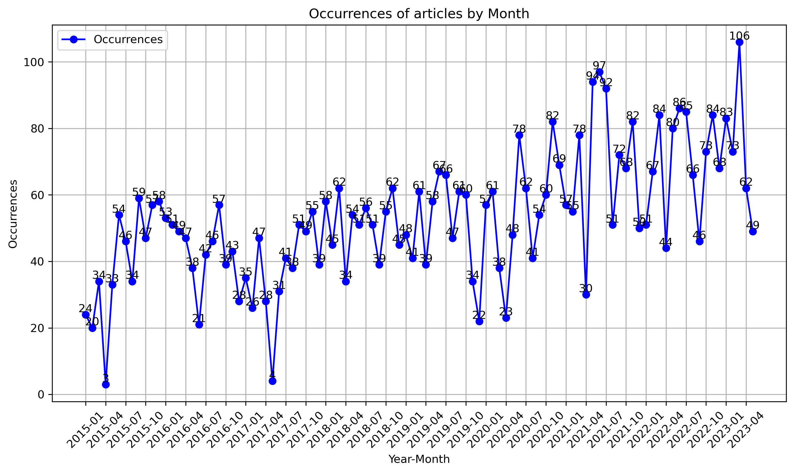
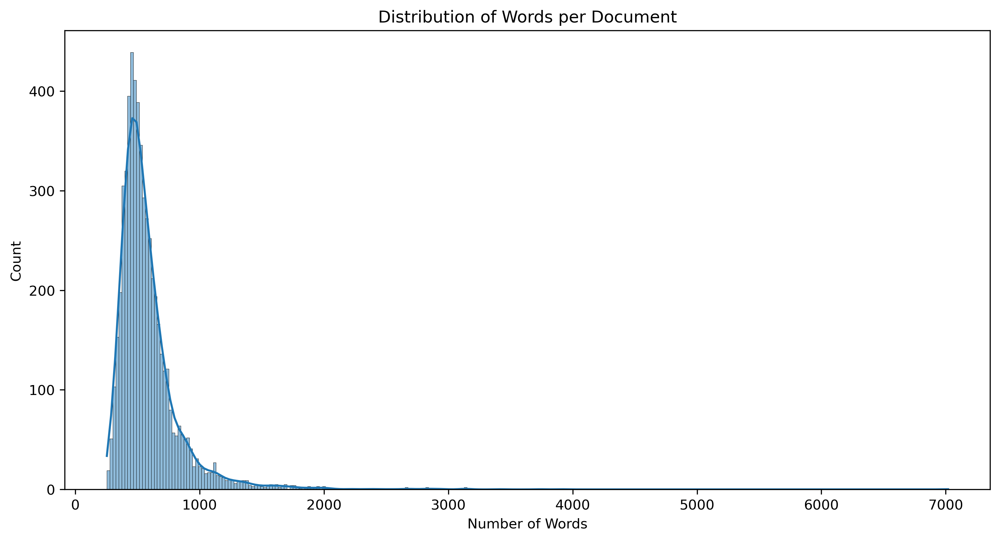

# Web Scraping Project: GoV.UK Articles

This repository contains scripts and data for scraping articles from the GoV.UK website. The project aims to extract the date, content, and title of approximately 6000 articles from GoV.UK. The extracted data is stored in a JSON format and can be further processed for analysis.

## Prerequisites

Before running the scripts, ensure that you have the following dependencies installed:

- Python 3
- `requests` library
- `beautifulsoup4` library
- `pandas` library
- `nltk` library
- `wordnet` corpus (from `nltk`)
- `omw-1.4` corpus (from `nltk`)

You can install the required libraries by running the following command: pip install -r Requirements.txt


## Files

- `myspider.py`: Uses Scrapy framework to scrape the GoV.UK articles and extract the title, content, and URL of each article.
- `web_scrapper.py`: Uses BeautifulSoup and requests to scrape the GoV.UK articles, extract the text and date, and update the JSON data.
- `preprocess.py`: Preprocesses the data stored in `articles.json` for further analysis.
- `URLs.json`: Contains the URLs of the GoV.UK articles to be scraped.
- `articles.json`: Contains the scraped article data including the title, content, and date.


## Scrapy Script: `myspider.py`

The `myspider.py` script uses the Scrapy framework to crawl the GoV.UK website, extract the title, content, and URL of each article, and store the data in the `articles.json` file.

To run the script, execute the following command: scrapy runspider myspider.py -o articles.json


## BeautifulSoup Script: `web_scrapper.py`

The `web_scrapper.py` script uses BeautifulSoup and requests libraries to scrape the GoV.UK articles listed in the `URLs.json` file. It extracts the text and date from each article and updates the JSON data in the `articles.json` file.

To run the script, execute the following command: python web_scrapper.py URLs.json


## Preprocessing Script: `preprocess.py`

The `preprocess.py` script preprocesses the scraped JSON data stored in the `articles.json` file. It performs various text processing steps, such as converting to lowercase, removing punctuation, numbers, and stopwords, lemmatizing, stemming, and removing specific words. It also filters the data based on the date and converts the date column to year-month periods.

To run the script, execute the following command: python preprocess.py articles.json


## Usage

1. Using Scrapy to scrape GoV.UK articles:

   - Make sure the `URLs.json` file contains the URLs of the GoV.UK articles to be scraped.
   - Run the following command to start the Scrapy spider and save the extracted data in the `articles.json` file:

     ```
     scrapy runspider myspider.py -o articles.json
     ```

2. Using BeautifulSoup and requests to scrape GoV.UK articles:

   - Make sure the `URLs.json` file contains the URLs of the GoV.UK articles to be scraped.
   - Run the following command to scrape the articles and update the JSON data in the `articles.json` file:

     ```
     python web_scrapper.py URLs.json
     ```

## Contributing

Contributions to this repository are welcome. If you encounter any issues or have suggestions for improvement, please open an issue or submit a pull request.

The repository provides functionality to generate various visualizations based on the scraped data. Here are some examples:

## Data Visualizations

The repository provides functionality to generate various visualizations based on the scraped data. Here are some examples:

The repository provides functionality to generate various visualizations based on the scraped data. Here are some examples:

1. Word Cloud of Articles:
   <div style="text-align: center;">
     
   </div>
   Generate a word cloud visualization based on the content of the articles.
   This visualization helps to understand the most frequently occurring words in the articles.

2. Word Cloud of Titles:
   <div style="text-align: center;">
     
   </div>
   Generate a word cloud visualization based on the titles of the articles.
   This visualization helps to identify the most common words used in the titles.

3. Occurrence over Time Plot:
   <div style="text-align: center;">
     
   </div>
   Generate a plot showing the occurrence of articles over time.
   This visualization helps to understand the distribution of articles across different time periods.

4. Distribution of Number of Words per Document:
   <div style="text-align: center;">
     
   </div>
   Generate a distribution plot showing the number of words in each document.
   This visualization helps to understand the length distribution of the articles.


## Acknowledgments

- The `scrapy` library: [Link](https://scrapy.org/)
- BeautifulSoup: [Link](https://www.crummy.com/software/BeautifulSoup/)
- The `requests` library: [Link](https://docs.python-requests.org/)

Please refer to the documentation of the above libraries for more information on their usage.


